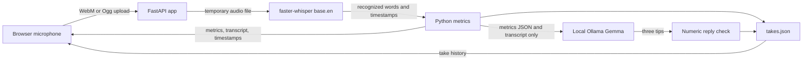

# Second Take

I built Second Take as a local speaking-practice partner for a 15-year-old. I can record one English-speaking practice take in the browser, transcribe it locally, calculate speaking metrics from word timestamps, and ask a local Gemma model for three timestamp-specific tips. It is a small practice tool, not a validated speech assessment.

## Quickstart: Windows and a virtual environment

I use Python 3.11 and the project virtual environment. From PowerShell in this folder, install the Python dependencies:

```powershell
py -3.11 -m venv .venv
.\.venv\Scripts\python.exe -m pip install -r requirements.txt
```

Start Ollama in its own terminal if it is not already running:

```powershell
ollama serve
```

In another terminal, download the local model once:

```powershell
ollama pull gemma3:1b
```

Then start the app with this one command:

```powershell
.\.venv\Scripts\python.exe -m uvicorn app:app --host 127.0.0.1 --port 8000
```

Open <http://127.0.0.1:8000>. The first transcription downloads Whisper's `base.en` model. I can select a different installed Ollama model with `$env:SECOND_TAKE_OLLAMA_MODEL = "model-name"` before starting Uvicorn.

## Quickstart: Docker

Docker Compose runs the app and Ollama in separate local containers and persists the Ollama and take data in named volumes. From this folder, run this one command:

```powershell
docker compose up --build
```

In a second terminal, download Gemma into the Ollama container once:

```powershell
docker compose exec ollama ollama pull gemma3:1b
```

Then open <http://127.0.0.1:8000>. The first Whisper transcription downloads `base.en` into a persistent Docker volume. Stop the services with `Ctrl+C`; `docker compose down` stops and removes the containers but keeps named data volumes. To delete the stored takes and models too, use `docker compose down --volumes`.

## Reproduce the checked results

From the project folder, run:

```powershell
make reproduce
```

This runs the hand-made timestamp metrics test and compiles the Python app and test. The test output includes a synthetic 65-second sample: 8 words, 7.38 overall WPM, window paces of 8, 6, and 12 WPM, three pauses (0.8, 27.5, and 33 seconds), and three fillers (2.77 per minute). These are test-fixture outputs, not results from an actual recording. The test does not download Whisper, contact Ollama, or measure transcription quality.

If `make` is not installed, run the test directly in PowerShell:

```powershell
.\.venv\Scripts\python.exe -m unittest -v test_metrics
```

## Architecture



Audio is held in a temporary file for transcription and deleted afterward. The audio itself is not added to the take history. On the default local setup, `takes.json` is written next to `app.py`. Docker stores that file in a named volume. Whisper and Ollama model files are downloaded dependencies and are not included in this repository.

## Project layout

| Path | Purpose |
| --- | --- |
| `app.py` | FastAPI routes, local transcription, timestamp-only metrics, coaching request, and take storage |
| `static/index.html` | Single-page recording and review UI |
| `static/app.js` | MediaRecorder, transcript highlighting, waveform, metrics, tips, and take trend chart |
| `static/style.css` | Responsive, plain browser styling |
| `test_metrics.py` | Deterministic test using hand-made word timestamps |
| `docs/SPEC.md` | Original request reproduced as the project rubric |
| `Dockerfile`, `compose.yaml` | Container build and local app/Ollama services |
| `Makefile` | `run` and `reproduce` commands |

## Rubric-to-evidence

The criterion wording in the first column is reproduced word for word from [`docs/SPEC.md`](docs/SPEC.md). Evidence describes the implementation; it does not claim unrun end-to-end checks.

| Criterion | Evidence | Status / result |
| --- | --- | --- |
| 1. Backend (app.py): POST /analyze accepts an audio upload (browser MediaRecorder webm/ogg) and a label for the take. Transcribe with faster-whisper, model base.en, word_timestamps=True, vad_filter=False, and an initial_prompt that contains example disfluencies ("Umm, so, like, I think, uh, basically..." ) so Whisper keeps filler words. Compute, from word timestamps only: duration; words per minute over the whole recording; words per minute for each 30-second window; every gap between consecutive words of at least 0.7 s listed as a long pause with start, end, length and the words around it; filler counts and timestamps split into hesitation fillers (um, uh, umm, er, hmm) and filler words (like, basically, actually, you know, i mean); fillers per minute. Return JSON. | `app.py`; `test_metrics.py` | Implemented. The synthetic metrics test passes; HTTP `GET /` and `GET /takes` returned 200 in a smoke check. Live transcription was not verified as part of `make reproduce`. |
| 2. Coaching: call Ollama at http://localhost:11434/api/generate with model gemma3:1b (model name from an environment variable). Send only the computed metrics JSON and the transcript, and instruct it to write exactly three short tips, each naming a specific timestamp from the metrics, no medical or personality judgements, plain friendly language for a teenager. After the reply, add a check: extract every number from the model text and flag any number that does not appear in the metrics; show that result in the JSON as numbers_check. | `app.py` (`_coach`, `_number_values`); `static/app.js` | Implemented with local Ollama URL/model configuration and a numeric check. The check flags numeric values absent from the metrics; the language model can still give bad tips or fail its format instructions. Live Ollama coaching was not verified by the reproduction test. |
| 3. Takes: store each take's metrics in takes.json next to the app (local file). GET /takes returns them. The page shows a small bar chart of fillers per minute and long pauses per take so progress across takes is visible. | `app.py` (`_save_take`, `/takes`); `static/app.js`; local `takes.json` | Implemented. Metrics/transcript are written locally; history chart plots fillers per minute and pause count. HTTP history route returned 200 in a smoke check. |
| 4. Frontend (static/index.html, static/app.js, static/style.css): a Record / Stop button using MediaRecorder; an audio player for the take; the transcript with filler words and words before and after each long pause highlighted; clicking a highlight seeks the audio to that second; a simple canvas waveform with the long-pause regions shaded; the metrics; the three tips; the trend chart; clear loading and error states, including a visible message if Ollama or the whisper model is not available. Plain, readable design, no gradients, no emoji, system sans-serif font. | `static/index.html`, `static/app.js`, `static/style.css` | Implemented. The page loaded in a browser; microphone capture and a complete recorded-take review were not verified in the reproduction test. |
| 5. A test for the metrics function using a hand-made list of words with timestamps (pauses, fillers, wpm windows). Run it and show the output. | `test_metrics.py` | Passed with a synthetic 65-second fixture; output is listed under “Reproduce the checked results.” |
| 6. README.md in plain first-person language: what it is, how to run it (the commands), what it measures and what it cannot (Whisper can drop filler words even with the prompt; only English; one speaker; not a replacement for a teacher), and that all processing is local. | `README.md` | This file documents run commands, measurements, limitations, data handling, architecture, setup, evidence, and citations. |
| 7. Reply briefly with: what exists, the exact commands to start the app, and anything you could not verify. | Final response | Delivery instruction; see the response accompanying this project. |

## What I measure

The Python metrics function computes duration, total words, overall words per minute, 30-second-window words per minute, every between-word gap of at least 0.7 seconds, and counts/timestamps for hesitation fillers (`um`, `uh`, `umm`, `er`, `hmm`) and filler words (`like`, `basically`, `actually`, `you know`, `I mean`). Fillers per minute uses the sum of those filler instances divided by timestamp-derived duration. Window counts assign a word to the window containing its start timestamp. Duration ends at the last recognized word's end; silence before the first or after the last recognized word is not included.

The browser highlights recognized filler words and the words immediately before and after detected pauses. The coaching prompt receives computed metrics and the transcript, but not the full word-timestamp list. Its reply is checked by extracting numeric tokens and checking them against numbers present in the computed metrics. This is a simple literal check, not proof that advice is correct, that every tip names a useful timestamp, or that the model returned exactly three tips.

## Limitations and privacy

- Whisper can omit filler words even with the initial prompt. All derived metrics describe recognized words, not guaranteed ground truth.
- The current configuration is English-only (`base.en`) and assumes one speaker; it does not perform diarization.
- Word-timestamp duration excludes unrecognized leading and trailing silence. A partial final 30-second window is normalized by its actual length.
- Ollama tips are generated text, not trusted measurements. The numeric check can flag unfamiliar numbers but cannot prevent nonnumeric hallucinations, validate advice, or enforce exactly three short tips.
- The UI reports model-service failures, but it does not provide an offline coaching fallback. The first model downloads require network access; inference requests afterward go to local services.
- Audio is temporarily stored on disk while Whisper reads it and is then deleted. Metrics and transcript persist in `takes.json` (or Docker's named data volume) until the user removes them. This is intended for local use on a trusted computer, not a multi-user or hardened deployment.
- This is not medical advice, a diagnosis, or a replacement for a teacher.
- I have not measured transcription accuracy or run a user study.

## Citations

I use [faster-whisper](https://github.com/SYSTRAN/faster-whisper) with the [Whisper `base.en` model](https://huggingface.co/Systran/faster-whisper-base.en) for transcription, and [Ollama](https://github.com/ollama/ollama) with [Gemma](https://ai.google.dev/gemma) for local coaching. I rely on the upstream projects for their current model and software terms.